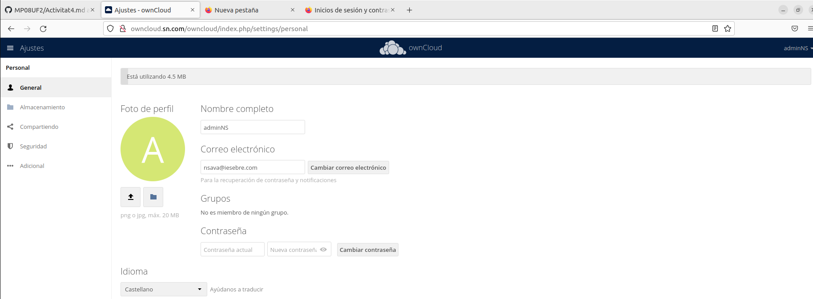

# Activitat 4 Aplicacions Web

## 4.1.- Crea un usuari admin que es digui adminXYZ, on XYZ són les inicials del teu nom:

## 4.2.- Inicia sessió com a l'usuari adminXYZ.

## 4.3.- Crea un usuari XYZ on XYZ son les inicials del company/a i afegeix-lo al grup usuaris, aquest usuari tindrà una quota de 512 MB.

## 4.4.- Podem crear fitxers d'una mida determinada a Linux amb la comanda:

## 4.5.- Mostra el missatge d'error per haver superat la quota d'usuari.

## 4.6.- Busca al teu perfil quin percentatge de quota estas utilitzant.

## 4.7.- Canvia la quota de l'usuari a 1GB i mostra tots els fitxers pujats.

## 4.8.- Crea un usuari anomenat usuari2XYZ i fical al grup usuaris.

## 4.9.- Comparteix un fitxer de usuariXYZ a usuari2XYZ i mostra com l'usuari2XYZ pot veure i descarregar el fitxer.

## 4.10.- Esborra la carpeta Learn more about owncloud.

## 4.11.- Recupera la carpeta Learn more about owncloud.

## 4.12.- Com a usuariXYZ crea una carpeta nova anomenada shared i comparteix-la amb l'usuari usuari2XYZ.

## 4.13.- Entra a Market instal·la dues aplicacions que no estiguin ja instal·lades i explica què fan i com funcionen.

### Calendar

Per instalar el canlendari hem de fer clic damunt del link (Calendar) que ens portara a la seguent pagina, hon baix de tot aurem de fer click INSTALL i ja ho tindriem installa.

Quan ho tinguessem hem de anar al quadrat de dalt hon diu marquet i alli estara el nostre calendari ho podriem entrar i escriure coses per a depent quins dies.

